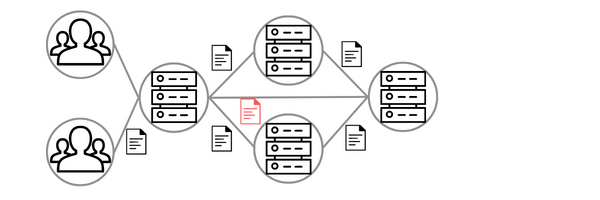

<p align="center"></p>

[](https://github.com/Nirvana77/Filesystem)
[](https://github.com/Nirvana77/Filesystem)
[](https://github.com/Nirvana77/Filesystem/issues)

# Filesystem
Easy to use, user based file shearing system.

# Installation
```
$ sudo apt-get update && sudo apt-get upgrade -y
$ sudo apt-get install -y libjansson-dev gcc libcurl4-gnutls-dev git
$ git clone https://github.com/Nirvana77/Filesystem.git
$ cd Filesystem
$ ./compile
```

# Configuration
- `Port`: Sets the `port` for the communication with the server.
- `IP`: Sets the `IP` for the communication with the server.
- `version`: definse the JSON `version` for the settings.
- `Path`: Set the root `Path` for the system.

# Usage
- `Mode`: If is `deamon` or none.
- `Path`: Is the path for the filesystem.

```
& ./bin/main <Mode> <Path>
```

# Contribute
1. Fork the repo and create a new branch: `$ git checkout -b name_for_new_branch`.
2. Make changes and test
3. Submit Pull Request with comprehensive description of changes

# Issues or Bugs
1. Go to the [Issues](https://github.com/Nirvana77/Filesystem/issues) page in the repo.
2. Create a new issues with descriptiv title and steps for the Issues or Bug, gits [ syntax](https://docs.github.com/en/get-started/writing-on-github/getting-started-with-writing-and-formatting-on-github/basic-writing-and-formatting-syntax) can be used.

# Donations

# License
[MIT](LICENSE)